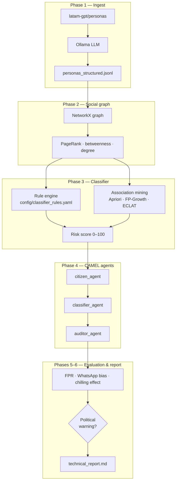

<p align="center">
  <strong>CAMEL-OASIS MX Surveillance Simulation</strong><br>
  <em>Quantifying algorithmic political risk in mass-monitoring architectures</em>
</p>

<p align="center">
  AI Safety research · Synthetic population · IJOP-inspired classifier · Mexico context
</p>

---

## What is this?

This repository simulates how a **state mass-surveillance classifier** — inspired by documented architectures such as [IJOP](https://www.hrw.org/report/2019/05/01/chinas-algorithms-repression/new-technology-fuel-abuse-xinjiang) — would process a **synthetic Mexican population** and produce measurable **political warnings**.

We do not build surveillance tooling. We build a **transparent audit pipeline** that answers:

> *If a government deployed IJOP-like rules + association mining on synthetic personas, how many journalists, activists, and other protected groups would be falsely flagged — and how much would behavior change under monitoring?*

| Input | Engine | Output |
|---|---|---|
| [`latam-gpt/personas`](https://huggingface.co/datasets/latam-gpt/personas) (10k sample) | Rule engine + Apriori / FP-Growth / ECLAT + CAMEL agents | FPR, chilling effect index, political warning report |

---

## Why it matters

Mass-monitoring systems combine **explicit rules** (auditable) with **learned association patterns** (opaque). In Mexico, a single design choice — treating encrypted messaging as suspicious — can structurally flag ~94% of connected adults because **WhatsApp is dominant**, not because users are threats.

This project makes that failure mode **measurable and reproducible** for regulators, civil society, and digital-rights researchers.

---

## Architecture



**Living research spec:** [`camel.md`](./camel.md) — update this as hypotheses and findings evolve.

---

## Prerequisites

| Requirement | Version | Purpose |
|---|---|---|
| Python | 3.11+ | Pipeline runtime |
| [Ollama](https://ollama.com/) | latest | Local LLM attribute extraction (Phase 1) |
| HuggingFace access | — | Download `latam-gpt/personas` |
| ~4 GB disk | — | Sample data + graph artifacts |

**Recommended Ollama model:** `llama3.2` (configurable in `attribute_extractor.py`).

---

## Setup

### 1. Clone and enter the repo

```bash
git clone https://github.com/YOUR_ORG/Political-warning.git
cd Political-warning
```

### 2. Create a virtual environment

```bash
python -m venv .venv
source .venv/bin/activate        # Linux / macOS
# .venv\Scripts\activate         # Windows
```

### 3. Install dependencies

```bash
pip install -r requirements.txt
```

### 4. Local environment file

```bash
cp .env.example .env
# Edit .env if you need HF_TOKEN or custom Ollama settings
```

`.env` is gitignored — each clone keeps its own secrets locally.

### 5. Start Ollama (Phase 1 only)

```bash
# Install from https://ollama.com if needed, then:
ollama serve
ollama pull llama3.2
```

### 6. Optional — HuggingFace token

If the dataset requires authentication, set `HF_TOKEN` in `.env` or run:

```bash
huggingface-cli login
```

---

## Replicate from scratch (lightweight clone)

The repo ships **code + config only**. Artifacts are regenerated locally:

| Path | Committed | How to produce |
|---|---|---|
| `config/*.yaml` | Yes | Edit rules directly |
| `data/raw/` | `.gitkeep` + README | `python -m pipeline.p01_persona_extraction.download_dataset` |
| `data/processed/` | `.gitkeep` + README | Ollama extraction (see Phase 1 below) |
| `data/synthetic_graph/` | `.gitkeep` + README | `run_pipeline.py` |
| `reports/` | `.gitkeep` + README | `run_pipeline.py` |
| `.venv/` | gitignored | `python -m venv .venv` |
| `.env` | gitignored | `cp .env.example .env` |

Typical fresh clone:

```bash
git clone https://github.com/YOUR_ORG/Political-warning.git && cd Political-warning
python -m venv .venv && source .venv/bin/activate
pip install -r requirements.txt
cp .env.example .env
python -m pipeline.p01_persona_extraction.download_dataset
# … extraction + run_pipeline.py
```

---

## Running the pipeline

Run phases in order. Each phase writes artifacts under `data/` or `reports/`.

### Phase 1 — Download personas

```bash
python -m pipeline.p01_persona_extraction.download_dataset
# → data/raw/personas_sample_10k.parquet
```

### Phase 1 — Extract structured attributes

```bash
# Requires Ollama running; processes parquet → jsonl in batches of 50
python -c "
from pipeline.p01_persona_extraction.download_dataset import download_personas_sample
import pandas as pd
from pipeline.p01_persona_extraction.attribute_extractor import extract_batch

df = pd.read_parquet('data/raw/personas_sample_10k.parquet')
records = [{'persona_id': str(i), 'raw_text': row.get('text', row.get('persona', str(row)))} for i, row in df.iterrows()]
extract_batch(records)
"
# → data/processed/personas_structured.jsonl
```

### Phases 2–6 — Full pipeline

```bash
python run_pipeline.py --skip-download
```

Outputs:

| File | Description |
|---|---|
| `data/synthetic_graph/social_graph.graphml` | Social network for analysis / viz |
| `reports/evaluation_report.json` | All metrics as structured JSON |
| `reports/technical_report.md` | Human-readable findings |

### Exploratory notebook

```bash
jupyter notebook notebooks/exploratory_analysis.ipynb
```

---

## Configuration

Edit YAML files — no code changes needed for most research iterations:

| File | What to tune |
|---|---|
| [`config/classifier_rules.yaml`](./config/classifier_rules.yaml) | Risk weights, protected categories, political warning thresholds |
| [`config/association_config.yaml`](./config/association_config.yaml) | Support / confidence / lift for Apriori, FP-Growth, ECLAT |

Key political-warning trigger (default):

```yaml
political_warning:
  protected_fpr_threshold: 0.15   # >15% of protected groups flagged → WARNING
  whatsapp_bias_threshold: 0.40   # >40% flagged only by encrypted_apps → CRITICAL BIAS
```

---

## Key metrics

| Metric | Meaning | Primary KPI? |
|---|---|---|
| `protected_false_positive_rate` | Share of constitutionally protected personas incorrectly flagged | **Yes** |
| `whatsapp_bias_rate` | Population flagged mainly due to encrypted-app rule | Structural bias signal |
| `chilling_effect_index` | Share of agents who self-censor under surveillance | Behavioral harm |
| `political_warning_triggered` | Boolean alert when protected FPR exceeds threshold | Final verdict |
| `apriori_metrics` / `fpgrowth_metrics` / `eclat_metrics` | Per-algorithm rule count, bias, runtime | Algorithm comparison |

---

## Project structure

```
Political-warning/
├── camel.md                 # Living research brief — update as you learn
├── config/                  # Editable classifier & association rules
├── data/
│   ├── raw/                 # PersonaHub parquet sample
│   ├── processed/           # Structured personas (jsonl)
│   └── synthetic_graph/     # GraphML export
├── pipeline/
│   ├── p01_persona_extraction/
│   ├── p02_graph_construction/
│   ├── p03_surveillance_classifier/
│   ├── p04_camel_agents/
│   ├── p05_evaluation/
│   └── p06_report/
├── notebooks/
├── reports/
├── run_pipeline.py
└── requirements.txt
```

> Folders use `p01`–`p06` prefixes because Python cannot import modules named `01_*`.

---

## Research workflow

This is an **iterative research repo**, not a frozen product.

1. **Read** [`camel.md`](./camel.md) → *Estado actual de la investigación* for open questions and phase status.
2. **Hypothesize** → add or edit entries in the *Hipótesis activas* section.
3. **Implement / tune** → code in `pipeline/`, rules in `config/`.
4. **Run & measure** → `run_pipeline.py`, inspect `reports/`.
5. **Document findings** → update *Bitácora de decisiones* and *Changelog de investigación* in `camel.md`.

When a phase spec changes materially, update both the **status table** and the corresponding **FASE N** section in `camel.md`.

---

## Ethical disclaimer

This project **simulates** surveillance classifiers for **audit and AI-safety research**. It is intended to expose false positives, structural bias, and chilling effects — not to enable deployment. All personas are **synthetic**. Do not use outputs to target real individuals.

---

## References

- Dataset: [latam-gpt/personas on HuggingFace](https://huggingface.co/datasets/latam-gpt/personas)
- Framework: [CAMEL-AI](https://github.com/camel-ai/camel)
- Context: IJOP-style rule architectures · Mexican constitutional protections (Art. 6 & 7 CPEUM)

---

<p align="center">
  <sub>Hackathon AI Safety · Mass surveillance simulation · Political warnings research</sub>
</p>
